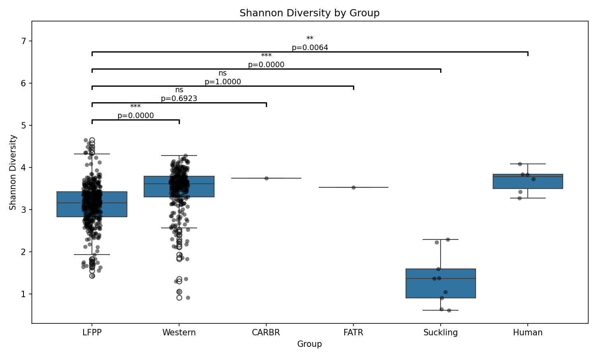

## Microbial Diversity Analyzer

A Python pipeline for analyzing microbial community diversity from abundance data. The pipeline computes alpha diversity metrics and generates detailed figures via an easy to use streamlit interface.

## Example Usage

Run against real published mouse gut microbiome data (Turnbaugh et al., 2009). comparing diet groups against an LFPP control diet.



## Installation

```bash
git clone https://github.com/oswan-1225/microbial-diversity-analyzer.git
cd microbial-diversity-analyzer
pip install -r requirements.txt
```

## Quickstart (CLI)

```bash
python main.py --input your_data.csv --control control_group_name --group_col group_column_name
```

this produces, in a 'results/' directory a handful of files:
- `summarized_data.csv` - per-sample richness and Shannon diversity
- `{metric}_stats_results.csv` - Bonferroni-corrected group comparisons vs. controls
- `{metric}_boxplot.png` - annotated boxplot with significance stars for each group vs. control

### Example: real dataset with coded categorical values

If your group column uses numeric codes instead of readable labels:

```bash
python main.py --input data.csv --control LFPP --group_col Diet \
  --exclude_cols Sex Source Donor CollectionMet --no_index_col \
  --relabel "Diet:0=LFPP,1=Western,2=CARBR,3=FATR,4=Suckling,5=Human"
```

## Quickstart (Web App)

```bash
streamlit run web_app.py
```

Upload a CSV, use the sidebar to selectr your group column, relabel if needed, exclude columns if needed, and run the analysis. The results will be displayed in the main panel, and you can download the summarized data and figures.

## CLI Arguments

| Argument | Required | Default | Description |
|---|---|---|---|
| `--input` | Yes | — | Path to the input CSV file |
| `--control` | Yes | — | Which value in `group_col` is the control/baseline group |
| `--output` | No | `results` | Directory to save output files |
| `--group_col` | No | `group` | Name of the column containing group labels |
| `--exclude_cols` | No | none | Extra metadata columns (not taxa data) to exclude, e.g. `--exclude_cols Sex Donor` |
| `--metrics` | No | both | Which diversity metrics to compute: `species_richness`, `shannon_diversity`, or both |
| `--richness_threshold` | No | `0.0` | Minimum value for a taxon to count as "present". Use `0.0` for raw counts; a small positive value (e.g. `0.0001`) for relative-abundance data with noise-level near-zero values |
| `--on_missing` | No | `error` | How to handle missing (NaN) values: `error` (refuse and explain), `fill_zero`, or `drop_rows` |
| `--no_index_col` | No | off | Pass this if your CSV has no dedicated sample-ID column (every column is real data) |
| `--relabel` | No | none | Relabel coded values in a column, e.g. `--relabel "Diet:0=LFPP,1=Western"` |

## Project structure

```
microbial-diversity-analyzer/
├── main.py              # CLI entry point
├── web_app.py            # Streamlit web UI
├── requirements.txt
├── src/
│   ├── diversity_analyzer.py   # species_richness, shannon_diversity, summarize_diversity
│   ├── stats_tests.py          # Mann-Whitney U, multi-group comparison, Bonferroni correction
│   ├── visualize.py            # annotated boxplot generation
│   ├── validation.py           # input validation, missing-value handling
│   ├── relabeling.py           # decode coded categorical columns
│   └── pipeline.py             # full pipeline orchestration
├── tests/                  # simple suite of tests.
└── docs/                  # example figure
```

## Design notes

- **Missing values are never silently guessed.** By default, the pipeline refuses to run if it finds NaN values, and requires you to explicitly choose `fill_zero` or `drop_rows` since what a missing value *means* (undetected vs. failed measurement) depends on your data and isn't something the tool should assume.

- **Species richness assumes raw counts by default.** Relative-abundance data (proportions, not integer reads) can contain extremely small nonzero "noise" values that shouldn't count as real detections. Use `--richness_threshold` to set a meaningful cutoff for this kind of data.

- **Bonferroni correction is conservative by design.** It reduces false positives across multiple comparisons at some cost to statistical power which is appropriate for confirmatory analysis, but worth knowing if you're doing exploratory work with many groups.
